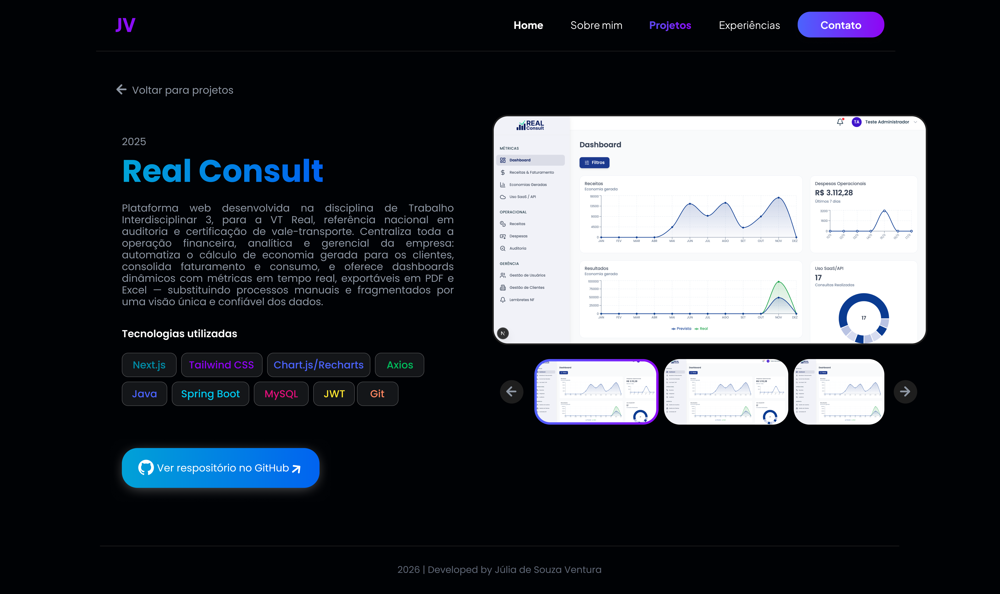

<div align="center">

# **Portfólio profissional com cena 3D interativa de dados, construído com Three.js e React Three Fiber.**
Desenvolvido para apresentar minha trajetória, projetos e experiência na área de **Dados & Inteligência Artificial**, com uma cena 3D contínua de partículas conectadas que reagem ao scroll.

</div>

<div align="center">


</div>

---

## ✪ Sumário

* [📘 Visão Geral](#-visão-geral)
* [🎯 Objetivo e Escopo](#-objetivo-e-escopo)
* [🎨 Wireframes e Protótipo](#-wireframes-e-prototipo)
* [🧱 Tecnologias e Arquitetura](#-tecnologias-e-arquitetura)
* [📁 Estrutura de Diretórios](#-estrutura-de-diretórios)
* [🚀 Seções do Site](#-seções-do-site)
* [🧪 Requisitos Mínimos](#-requisitos-mínimos)
* [🛠️ Execução do Projeto](#%EF%B8%8F-execução-do-projeto)
* [🌐 Acesso ao Site](#-acesso-ao-site)
* [📌 Status do Desenvolvimento](#-status-do-desenvolvimento)

---

## 📘 Visão Geral

Este é o meu portfólio profissional, desenvolvido para a disciplina de **Projeto de Software** (PUC Minas), com o objetivo de apresentar minha trajetória, tecnologias, projetos e experiência de forma moderna e visualmente alinhada à área de **Dados e Inteligência Artificial**.

* 🌌 **Cena 3D contínua:** partículas e nós conectados representando fluxo de dados, com profundidade e camadas reais em Three.js.
* 🧊 **Glassmorphism nos cards:** os elementos de interface têm efeito de vidro fosco, deixando a cena 3D visível através deles conforme a página é rolada.
* 📱 **Responsivo:** layout adaptado para desktop, tablet e mobile.

---

## 🎯 Objetivo e Escopo

* **Sobre Mim:** apresentação pessoal, formação, área de atuação e objetivos profissionais.
* **Tecnologias:** principais ferramentas e linguagens que utilizo no dia a dia.
* **Projetos:** linha do tempo dos projetos que desenvolvi, do mais antigo ao mais recente, com tecnologias, link do GitHub e imagens do sistema.
* **Experiência:** histórico de estágios e atuações profissionais.
* **Contato:** formulário funcional de contato e links diretos para e-mail, LinkedIn e GitHub.

---

## 🎨 Wireframes e Protótipo

Protótipo de média/alta fidelidade desenvolvido no Figma antes da implementação.

<div align="center">
  <br>
  <em>Home — Início, Sobre mim, Tecnologias, Projetos, Experiência e Contato</em>
</div>

<br>

<div align="center">
  <br>
  <em>Página de detalhe de projeto (ex: RealConsult)</em>
</div>

---

## 🧱 Tecnologias e Arquitetura

| Camada | Tecnologia | Responsabilidade Principal |
| :--- | :--- | :--- |
| **Frontend** | Next.js + TypeScript | Estrutura de páginas, rotas e componentes |
| **Estilização** | Tailwind CSS | Layout responsivo e sistema de design |
| **Cena 3D** | Three.js + React Three Fiber | Partículas conectadas, profundidade e interações de scroll |
| **Animações** | Motion (`motion/react`) | Entradas por scroll, hover dos cards e transições da navbar |
| **Tipografia** | `next/font` (Poppins, Plus Jakarta Sans) | Fontes do design, auto-hospedadas |
| **Conteúdo** | Módulos tipados em `src/data` | Projetos, experiências e canais de contato |

---

## 📁 Estrutura de Diretórios

```
src/
├── app/
│   ├── layout.tsx           # fontes, navbar e camadas de fundo
│   ├── page.tsx             # home, com todas as seções
│   └── projetos/[slug]/     # página de detalhe de cada projeto
├── components/
│   ├── layout/              # Navbar e Footer
│   ├── sections/            # Hero, Sobre Mim, Tecnologias, Projetos, Experiências e Contato
│   ├── three/               # cena 3D: bolhas de fundo e partículas de dados
│   └── ui/                  # peças reutilizáveis: ícones, botões e animações
└── data/                    # projetos, experiências e contatos
```

---

## 🚀 Seções do Site

* 🏠 **Início:** hero com cena 3D de partículas, nome, chamada principal e download do currículo.
* 👤 **Sobre mim:** foto, card de código, apresentação com alternância PT/EN pelas bandeiras e links sociais.
* 🛠️ **Tecnologias:** grade com as stacks utilizadas — React, Next.js, TypeScript, Tailwind CSS, Python, Three.js e MySQL.
* 📂 **Projetos:** grade de cards animados (PsiPlus, Real Consult e Maraú Hospedagens); cada card abre a página do projeto.
* 🔎 **Página do projeto** (`/projetos/[slug]`): ano, descrição, tecnologias utilizadas, carrossel de imagens com setas e miniaturas, e link para o repositório.
* 💼 **Experiência:** linha do tempo com os estágios, revelada conforme o scroll.
* ✉️ **Contato:** cartões de e-mail, WhatsApp e redes sociais, mais formulário com validação de campos obrigatórios.
* 🔻 **Rodapé:** assinatura do site.

---

## 🧪 Requisitos Mínimos

* **Node.js LTS** (v18+) & npm/yarn
* **Git**

---

## 🛠️ Execução do Projeto

\`\`\`bash
# 1. Clone o repositório
git clone https://github.com/juliaszventura/SEU-REPOSITORIO.git
cd SEU-REPOSITORIO

# 2. Instale as dependências
npm install

# 3. Rode o projeto localmente
npm run dev

# 4. Acesse no navegador
http://localhost:3000
\`\`\`

---

## 🌐 Acesso ao Site

🔗 *Em breve — link de hospedagem será adicionado na Sprint 03 (deploy em Vercel).*

---

## 📌 Status do Desenvolvimento

- [x] Planejamento e prototipação (Figma) — Lab01S01
- [x] Implementação das funcionalidades principais — Lab01S02
  - [x] Navbar, cena 3D de fundo e todas as seções da home
  - [x] Página de detalhe de projeto, com rotas estáticas para os três projetos
  - [ ] Envio real do formulário de contato (serviço de e-mail a definir)
  - [ ] Imagens e links de repositório dos projetos
- [ ] Hospedagem e finalização — Lab01S03